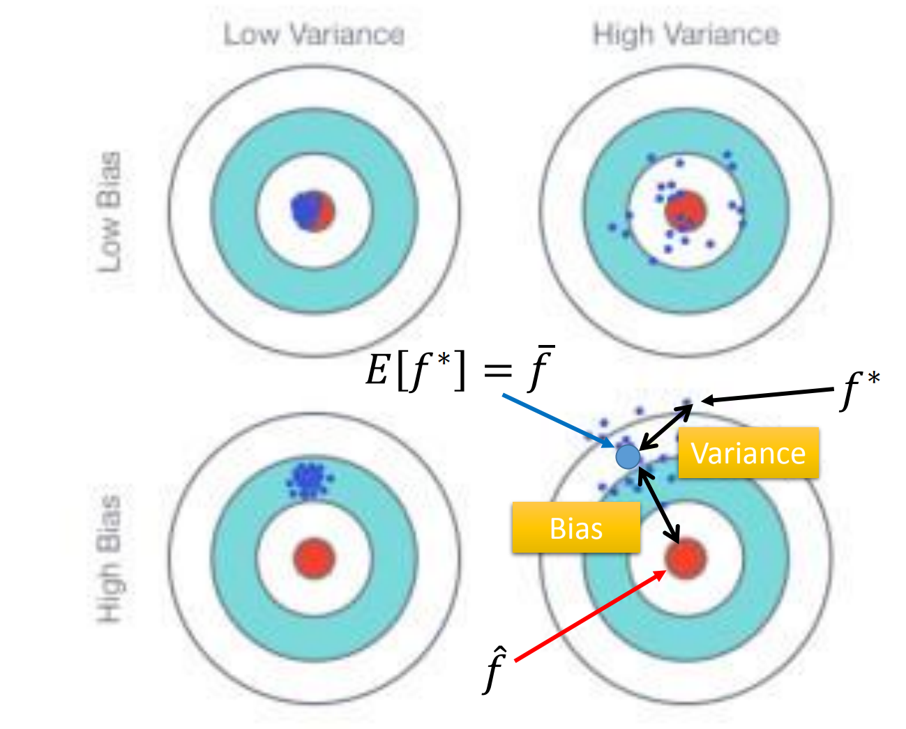

# introduction
## classification of ML
- Regression
- Binary Classification
- Multi-class Classification
- Generation
- supervised learning
- unsupervised learning
- meta learning
- reinforcement learning
- life-long learning
# Linear Regression 
*linear model* 　　 y=b+∑wixi  
*loss function* 　　L=∑(y^-y)2  
 overfitting :  
A more complex model does not always lead to better performance on test data
Regularization : L=∑(y^-y)2  +λ∑(wi)2  
 Regularization make the function more smoother to reduce the effects of noise.   
## bias&variances

generally speaking,the more complex linear regression model have lower bias and higher variance,the more simpler model have higher bias and lower variance.so the complex model usually overfitting,the
simple model usually underfitting.  
 
how to deal overfitting?  
1.more data  
2.regularization

## Gradient Descent Tips  
- reduce the learning rate by every few epoch  
$$
n^t=\frac{n}{\sqrt{t+1}}
$$
- learnig rate cannot be one-size-fits-all