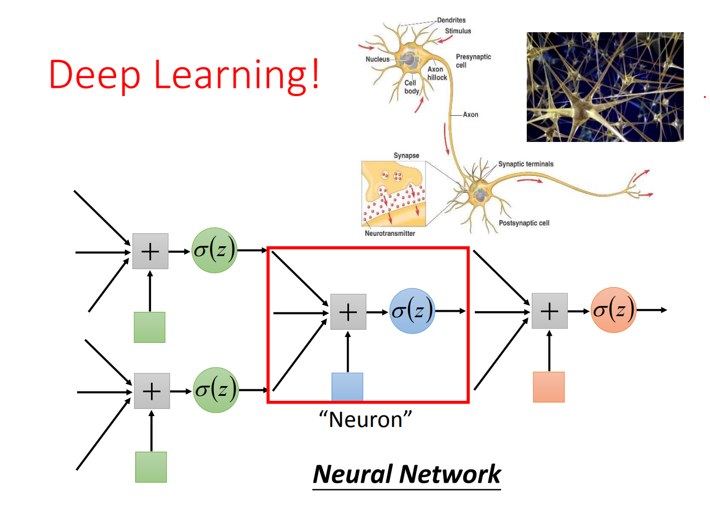

# introduction
## classification of ML
- Regression
- Binary Classification
- Multi-class Classification
- Generation
- supervised learning
- unsupervised learning
- meta learning
- reinforcement learning
- life-long learning
# Linear Regression
*linear model* 　　 　　  
*loss function*　　 　　  
 overfitting :  
A more complex model does not always lead to better performance on test data
Regularization : 　　　  
 Regularization make the function more smoother to reduce the effects of noise.   
## bias&variances
  
generally speaking,the more complex linear regression model have lower bias and higher variance,the more simpler model have higher bias and lower variance.so the complex model usually overfitting,the simple model usually underfitting.  
 how to deal overfitting?  
1.more data  
2.regularization
## Gradient Descent Tips
- reduce the learning rate by every few epoch.
　　　　　　　　　　　　　　　  
- learnig rate cannot be one-size-fits-all.
giving different paramenters different learning rate.
　　　　　　　　　　　　　　　  
　　　　　　　　　　　　　　　  
　　　　　　　　　　　　　　　  
- Stochastic Gradient Descent
pick an example xn in the model.
- Feature Scaling
# Classification
### Bayes formula
In the Binary Classification,the Bayes formula as follow:
　　　　　　　　　　　　　　　  
if the probability is greater than 0.5 output Class one,else output Class two.
### Gaussion Distribation
function of Gaussion Distribation:
　　　　　　　　　　　　　　　  
input:vector x,output:probability of sampling x. The shape of the function determines by mean u and vavariance matrix ∑.
we have class one feature:x1,x2,x3,....xn,we assume x1,x2,x3,....xn generate from the Gaussion function(u^,∑^).
　　　　　　　　　　　　　　　 
　　　　　　　　　　　　　　　
result:
　　　　　　　　　　　　　　　
　　　　　　　　　　　　　　　
simplify the Bayes formula:
　　　　　　　　　　　　　　　
　　　　　　　　　　　　　　　
so,the final formula as follow:
　　　　　　　　　　　　　　　
　　　　　　　　　　　　　　　
the Logistic Regression formula:
　　　　　　　　　　　　　　　
how to do gradient descent for Logistic Regression?
- Training data:

|x1| x2 | x3 | xn |
| -- | -- | -- | -- |
| C1 | C1 | C2 | C1 |
Assume the data is generated based on ,the Loss function as follow:
　　　　　　　　　　　　　　　
　　　　　　　　　　　　　　　
　　　　　　　　　　　　　　　
the loss function final is a bernoulli distribution
　　　　　　　　　　　　　　　
### multi-class classification
multi-class classification will use the softmax function:
　　　　　　　　　　　　　　　
cascading Logistic Regression models become Neural Network
　　　　　　　　　　　　　　　
The function of a layer of logistic regression is to transform the data into features .
